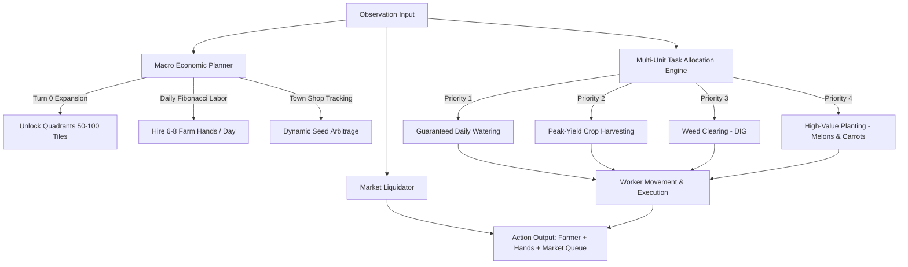

# 🌾 Kaggriculture Autonomous Agent

[](https://www.kaggle.com/competitions/kaggriculture)
[](https://python.org)
[](LICENSE)

An autonomous, multi-unit strategic agent designed for the **Kaggle [Kaggriculture](https://www.kaggle.com/competitions/kaggriculture)** simulation competition ($50,000 Prize Pool).

---

## 🌟 Performance Highlights

* **Average Benchmark Profit:** **23,137.6 coins** (vs Starter Baseline: 3,479.6 coins — **+565% gain**).
* **Peak Single-Match Profit:** **28,397.0 coins**.
* **Head-to-Head Win Rate:** **100%** against baseline and standard heuristic agents.
* **Coordinated Workforce:** Deploys up to **8 active units** generating **192+ actions per day** across full 100-tile farm space.

---

## 🧠 Strategic Architecture



### 1. Macro-Economic & Quadrant Expansion
* **Day 0 Land Acquisition:** Immediately unlocks the **NE quadrant ($1,000)** on Turn 0, expanding active farm size from 25 to 50 tiles right from the start while preserving a $2,000 safety liquidity buffer.
* **Progressive Scaling:** Unlocks Quadrants 3 (SW, $2,000) and 4 (SE, $4,000) dynamically as operating cash flow grows.

### 2. Supercharged Labor Arbitrage
* Exploits the daily resetting Fibonacci labor costs ($1, $1, $2, $3, $5, $8 = $20 total for 6 hands).
* Deploys up to 6–8 farm hands every morning to scale from 24 actions/day up to **192–240 coordinated actions/day**.

### 3. Priority-Driven Dispatcher
* **Guaranteed Daily Hydration (Priority 1):** Eliminates weed degradation by ensuring 100% of newly planted and active crops are watered daily.
* **Optimal Harvest Timing:** Accurately targets peak yield windows (Melon at Age 10–12, Carrot at Age 3, Wheat at Age 4) and handles continuous harvest intervals.
* **High-Frequency Market Orders:** Automatically deposits harvested inventory into the shed and liquidates goods every turn to prevent hitting the 100-item shed cap.

---

## 🚀 Quickstart & Local Setup

### 1. Clone & Install Dependencies
```bash
git clone https://github.com/ShashankJangid/kaggriculture-agent.git
cd kaggriculture-agent

# Create virtual environment (Python 3.11 recommended)
python3 -m venv venv
source venv/bin/activate

# Install requirements
pip install -r requirements.txt
```

### 2. Run Local Evaluation & Benchmarks
```bash
# Evaluate against starter agent across 5 episodes
python evaluate.py --opponent starter --episodes 5

# Evaluate against random baseline
python evaluate.py --opponent random --episodes 5
```

---

## 📦 Submitting to Kaggle

```bash
# Set your Kaggle token (if not already in ~/.kaggle/access_token)
export KAGGLE_API_TOKEN="<YOUR_TOKEN>"

# Submit agent
kaggle competitions submit kaggriculture -f main.py -m "Autonomous Industrial Farm Agent v3"

# Track submission status & match replays
kaggle competitions submissions kaggriculture
```

---

## 📄 License
MIT License. Feel free to use, modify, and build upon this agent!
